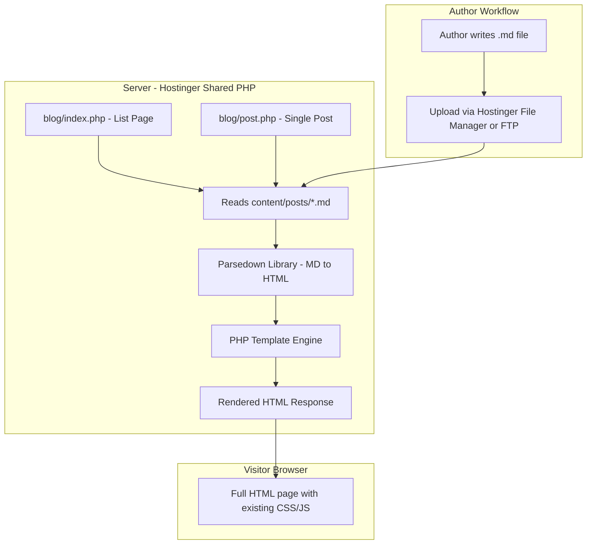
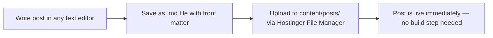
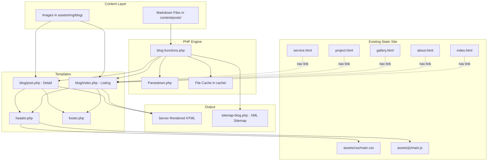

# Blog System Architecture Proposal — Okarowok Wibye Acel

## 1. Executive Summary

This document proposes a **PHP-powered flat-file blog system** for the Okarowok Wibye Acel clan website. The solution is purpose-built for the existing static HTML + Bootstrap + jQuery tech stack, runs natively on Hostinger Premium shared hosting, requires no database, no Node.js runtime, and no external services. Blog posts are authored as Markdown files and rendered server-side by a lightweight PHP engine that integrates seamlessly with the current page templates.

---

## 2. Current Project Analysis

### 2.1 Tech Stack Summary

| Layer | Technology |
|-------|-----------|
| Markup | Static HTML5 pages — `index.html`, `about.html`, `blog.html`, `gallery.html`, `project.html`, `service.html` |
| Styling | Bootstrap 5.3, custom SCSS compiled to `assets/css/main.css`, FontAwesome 6, AOS |
| JavaScript | jQuery 3.7.1, GSAP + ScrollTrigger, Slick/Owl/Swiper carousels, Magnific Popup |
| Fonts | Figtree via Google Fonts |
| Build tools | None detected — no `package.json`, `composer.json`, `Gemfile`, or CI config |
| Server-side | None — purely static files |
| Hosting | Hostinger Premium shared hosting |

### 2.2 Current Blog Page State

[`blog.html`](blog.html) is a 802-line static HTML file containing:
- Shared header/navigation and footer
- Hero breadcrumb section using `.common-hero`
- 8 hardcoded blog post cards using the `.blog2-box` component pattern
- Static pagination UI — non-functional
- All post links point to `href="#"` — no individual post pages exist
- Post images stored in `assets/img/blog/`

The existing SCSS in [`assets/scss/layout/blog/_blog.scss`](assets/scss/layout/blog/_blog.scss) defines multiple blog card styles — `.blog-box`, `.blog2-box`, `.blog3-box`, `.blog4-box` — plus sidebar and blog-page variants. The `.blog2-box` style with `.heading1` overlay card is the one actively used on the blog page.

---

## 3. Recommended Architecture: PHP Flat-File Blog

### 3.1 Why This Approach

```
┌─────────────────────────────────────────────────────────┐
│                   Decision Matrix                        │
├──────────────────────┬──────────┬───────────┬───────────┤
│ Criteria             │ PHP Flat │ WordPress │ Headless  │
│                      │ File     │           │ CMS       │
├──────────────────────┼──────────┼───────────┼───────────┤
│ Hostinger compat.    │ ★★★★★   │ ★★★★★    │ ★★☆☆☆    │
│ No major rewrite     │ ★★★★★   │ ★★☆☆☆    │ ★★★☆☆    │
│ Matches existing UX  │ ★★★★★   │ ★★☆☆☆    │ ★★★★☆    │
│ Simple for author    │ ★★★★☆   │ ★★★★★    │ ★★★☆☆    │
│ No external deps     │ ★★★★★   │ ★★★★★    │ ★☆☆☆☆    │
│ Performance          │ ★★★★★   │ ★★★☆☆    │ ★★★★☆    │
│ SEO                  │ ★★★★★   │ ★★★★★    │ ★★★☆☆    │
│ Maintenance burden   │ ★★★★☆   │ ★★☆☆☆    │ ★★★☆☆    │
└──────────────────────┴──────────┴───────────┴───────────┘
```

**PHP Flat-File wins** because:
1. **Hostinger Premium includes PHP 8.x** — runs natively, zero additional setup
2. **No database needed** — avoids MySQL complexity; posts are Markdown files on disk
3. **Minimal disruption** — existing HTML pages stay as-is; only `blog.html` and new blog routes change to PHP
4. **No external services** — fully self-hosted, no API keys, no third-party accounts
5. **Markdown authoring** — the author expressed willingness to learn Markdown, which is far simpler than HTML
6. **Excellent SEO** — server-rendered HTML, proper URLs, meta tags, all crawlable

### 3.2 Why NOT WordPress

WordPress would require a complete site rebuild into WordPress themes/templates, fundamentally changing the project structure. The existing hand-crafted HTML/CSS/JS would need to be converted into a WordPress theme. This is a disproportionate amount of work for a site that only needs blog functionality — everything else is static and working well.

### 3.3 Why NOT a Headless CMS

Headless CMS options like Contentful, Strapi, or Sanity would require:
- Client-side JavaScript API calls to fetch content — bad for SEO without server-side rendering
- External service accounts and API keys — contradicts the self-hosted preference
- Strapi self-hosted requires Node.js runtime — not available on Hostinger shared hosting

---

## 4. System Architecture

### 4.1 High-Level Architecture



### 4.2 Proposed Directory Structure

```
project-root/
├── index.html                    # Unchanged
├── about.html                    # Unchanged
├── gallery.html                  # Unchanged
├── project.html                  # Unchanged
├── service.html                  # Unchanged
├── .htaccess                     # NEW — URL rewriting for clean blog URLs
│
├── blog/
│   ├── index.php                 # NEW — Blog listing page, replaces blog.html
│   └── post.php                  # NEW — Individual blog post page
│
├── content/
│   └── posts/                    # NEW — Markdown blog post files
│       ├── 2026-02-15-oral-traditions-of-lango.md
│       ├── 2026-01-20-cultural-center-progress.md
│       └── ...
│
├── includes/
│   ├── header.php                # NEW — Shared header/nav extracted from HTML
│   ├── footer.php                # NEW — Shared footer extracted from HTML
│   ├── blog-functions.php        # NEW — Core blog engine functions
│   └── parsedown/
│       └── Parsedown.php         # NEW — Markdown parser library, single file
│
├── assets/                       # Unchanged
│   ├── css/
│   ├── js/
│   ├── img/
│   ├── scss/
│   └── fonts/
│
└── blog.html                     # DEPRECATED — replaced by blog/index.php
```

### 4.3 URL Structure

Using `.htaccess` mod_rewrite for clean, SEO-friendly URLs:

| URL Pattern | Maps To | Description |
|-------------|---------|-------------|
| `/blog/` | `blog/index.php` | Blog listing with pagination |
| `/blog/page/2/` | `blog/index.php?page=2` | Paginated listing |
| `/blog/oral-traditions-of-lango/` | `blog/post.php?slug=oral-traditions-of-lango` | Individual post |

The `.htaccess` rewrite rules:

```apache
RewriteEngine On
RewriteBase /

# Blog post: /blog/page/N/
RewriteRule ^blog/page/([0-9]+)/?$ blog/index.php?page=$1 [L,QSA]

# Blog post: /blog/slug-here/
RewriteRule ^blog/([a-z0-9-]+)/?$ blog/post.php?slug=$1 [L,QSA]

# Blog index
RewriteRule ^blog/?$ blog/index.php [L,QSA]
```

---

## 5. Content Management

### 5.1 Markdown Post Format

Each blog post is a single `.md` file with YAML front matter:

```markdown
---
title: The Oral Traditions of the Lango People
slug: oral-traditions-of-lango
date: 2026-02-15
author: Okarowok Editorial
image: oral_tradition.jpeg
excerpt: Exploring the rich oral heritage that has preserved Lango culture across generations.
tags: culture, heritage, oral-tradition
published: true
---

The Lango people have maintained a vibrant tradition of oral storytelling
that spans centuries. These stories serve not merely as entertainment,
but as vessels of cultural knowledge, moral instruction, and historical
record.

## The Role of Elders

Elders in Lango society serve as the primary custodians of oral tradition...

## Key Story Cycles

### The Origin Stories
The Lango trace their origins to...

### Moral Fables
Many stories center around...


## Preserving These Traditions Today

In the modern era, the challenge of preserving oral traditions...
```

### 5.2 Front Matter Fields

| Field | Required | Description |
|-------|----------|-------------|
| `title` | Yes | Post title displayed on listing and detail pages |
| `slug` | Yes | URL-safe identifier — must match filename convention |
| `date` | Yes | Publication date in `YYYY-MM-DD` format |
| `author` | Yes | Author name displayed on the post |
| `image` | Yes | Featured image filename — stored in `assets/img/blog/` |
| `excerpt` | Yes | Short summary for the listing page cards |
| `tags` | No | Comma-separated tags for categorization |
| `published` | Yes | `true` or `false` — drafts are hidden from the public |

### 5.3 Author Workflow



**Authoring tools the author can use:**
- **Hostinger File Manager** — built-in web file manager, no software install needed
- **Any text editor** — Notepad, VS Code, Typora, or even a phone-based Markdown editor
- **FTP client** — FileZilla or similar for bulk uploads

**No build step, no deployment pipeline, no command line required.** Upload the `.md` file and it is live.

### 5.4 Markdown Reference Card

A simple reference card will be provided as a standalone HTML page or PDF that the author can bookmark, covering:
- Headings: `## Heading`
- Bold/italic: `**bold**`, `*italic*`
- Links: `[text](url)`
- Images: ``
- Lists: `- item` or `1. item`
- Blockquotes: `> quote`

---

## 6. Core PHP Engine Design

### 6.1 `blog-functions.php` — Core Engine

This file contains all blog logic:

```
┌─────────────────────────────────────────┐
│           blog-functions.php             │
├─────────────────────────────────────────┤
│ parseFrontMatter(string $content)       │
│   → Extracts YAML front matter from MD  │
│                                         │
│ getAllPosts(string $postsDir)            │
│   → Scans content/posts/, parses all    │
│     .md files, returns sorted array     │
│                                         │
│ getPublishedPosts(string $postsDir)     │
│   → Filters to published:true only      │
│                                         │
│ getPostBySlug(string $slug)             │
│   → Finds and returns a single post     │
│                                         │
│ getPaginatedPosts(int $page, int $per)  │
│   → Returns a page slice + total pages  │
│                                         │
│ renderMarkdown(string $markdown)        │
│   → Uses Parsedown to convert MD→HTML   │
│                                         │
│ getPostsByTag(string $tag)              │
│   → Filters posts by tag               │
│                                         │
│ generateMetaTags(array $post)           │
│   → Returns SEO meta tags for a post    │
└─────────────────────────────────────────┘
```

### 6.2 `blog/index.php` — Listing Page

This replaces the current static `blog.html`. It:
1. Includes `header.php` — the shared site header/nav
2. Renders the hero breadcrumb section
3. Calls `getPaginatedPosts()` to get the current page of posts
4. Loops through posts, rendering each as a `.blog2-box` card using the **exact same HTML structure** currently in `blog.html`
5. Renders functional pagination links
6. Includes `footer.php`

The output HTML is **identical** to the current static blog page — same classes, same structure, same CSS — but dynamically generated from Markdown files.

### 6.3 `blog/post.php` — Single Post Page

A new page that does not currently exist. It:
1. Includes `header.php`
2. Renders the hero breadcrumb with the post title
3. Displays the featured image
4. Renders the Markdown body as HTML
5. Shows post metadata — date, author, tags
6. Optionally shows previous/next post navigation
7. Includes `footer.php`

The styling will use the existing blog detail SCSS classes already defined in [`_blog.scss`](assets/scss/layout/blog/_blog.scss) — specifically the `.blog-details` and `.sidebar-box-area` patterns that are already in the stylesheet but not yet used.

### 6.4 Parsedown Library

[Parsedown](https://parsedown.org/) is the recommended Markdown parser because:
- **Single PHP file** — no Composer, no dependencies, just drop `Parsedown.php` into the project
- **Fast** — one of the fastest PHP Markdown parsers
- **Well-tested** — widely used, stable, MIT licensed
- **Supports GitHub-flavored Markdown** — tables, fenced code blocks, etc.

---

## 7. Template System

### 7.1 Extracting Shared Components

The header and footer HTML are currently duplicated across all 6 HTML pages. For the blog system, these will be extracted into PHP includes:

```
┌──────────────────────────────────────────────────┐
│                  header.php                       │
│  Contains: DOCTYPE, head, meta tags, CSS links,  │
│  navigation bar, mobile sidebar                  │
│  Accepts: $pageTitle, $pageDescription,          │
│           $pageImage variables for SEO           │
└──────────────────────────────────────────────────┘

┌──────────────────────────────────────────────────┐
│                  footer.php                       │
│  Contains: Footer HTML, JS script tags,          │
│  closing body/html tags                          │
└──────────────────────────────────────────────────┘
```

**Important:** The existing static `.html` pages remain untouched. Only the blog pages use PHP includes. In a future phase, the static pages could optionally be converted to `.php` to share the header/footer includes, but this is not required for the blog system to work.

### 7.2 Blog Card Template

The blog listing will render each post using the exact `.blog2-box` HTML structure from the current `blog.html`:

```html
<div class="col-lg-6">
    <div class="blog2-box">
        <div class="image">
            " alt="<?= htmlspecialchars($post['title']) ?>">
        </div>
        <div class="heading1">
            <div class="tags">
                <a class="date" href="#">
                    
                    <?= date('d M, Y', strtotime($post['date'])) ?>
                </a>
                <a class="date outhor" href="#">
                    
                    <?= htmlspecialchars($post['author']) ?>
                </a>
            </div>
            <h4><a href="/blog/<?= $post['slug'] ?>/"><?= htmlspecialchars($post['title']) ?></a></h4>
            <p><?= htmlspecialchars($post['excerpt']) ?></p>
            <a class="learn" href="/blog/<?= $post['slug'] ?>/">
                Read More <span><i class="fa-solid fa-arrow-right"></i></span>
            </a>
        </div>
    </div>
</div>
```

This ensures **zero visual difference** from the current design — the same CSS applies without any changes.

---

## 8. SEO Considerations

### 8.1 Server-Side Rendering

All blog content is rendered server-side by PHP. Search engine crawlers receive complete HTML — no JavaScript rendering required. This is the gold standard for SEO.

### 8.2 Meta Tags

Each blog post page will include:

```html
<title>{Post Title} — Okarowok Wibye Acel</title>
<meta name="description" content="{Post excerpt}">
<meta property="og:title" content="{Post Title}">
<meta property="og:description" content="{Post excerpt}">
<meta property="og:image" content="https://okarowok.ac.ug/assets/img/blog/{image}">
<meta property="og:url" content="https://okarowok.ac.ug/blog/{slug}/">
<meta property="og:type" content="article">
<meta name="twitter:card" content="summary_large_image">
<link rel="canonical" href="https://okarowok.ac.ug/blog/{slug}/">
```

### 8.3 Structured Data

JSON-LD structured data for blog posts:

```json
{
    "@context": "https://schema.org",
    "@type": "BlogPosting",
    "headline": "Post Title",
    "image": "https://okarowok.ac.ug/assets/img/blog/image.jpg",
    "datePublished": "2026-02-15",
    "author": {
        "@type": "Person",
        "name": "Author Name"
    },
    "publisher": {
        "@type": "Organization",
        "name": "Okarowok Wibye Acel"
    }
}
```

### 8.4 Sitemap

A `sitemap-blog.php` file will dynamically generate an XML sitemap of all published blog posts, which can be submitted to Google Search Console.

### 8.5 Clean URLs

The `.htaccess` rewrite rules produce clean, descriptive URLs like `/blog/oral-traditions-of-lango/` instead of `blog/post.php?slug=oral-traditions-of-lango`.

---

## 9. Performance Considerations

### 9.1 File-System Caching

Since Markdown files are parsed on every request, a simple file-based cache will be implemented:

```
cache/
├── posts-index.json          # Cached list of all posts with metadata
└── posts/
    ├── oral-traditions.html   # Cached rendered HTML for each post
    └── ...
```

**Cache invalidation strategy:** The cache file's modification time is compared against the source `.md` file. If the `.md` file is newer, the cache is regenerated. This is automatic — no manual cache clearing needed.

### 9.2 Performance Profile

| Metric | Expected Performance |
|--------|---------------------|
| Blog listing page | < 100ms response time — reads cached JSON index |
| Individual post | < 50ms response time — serves cached HTML |
| Cold cache, first request | < 300ms — parses Markdown, writes cache |
| Memory usage | < 5MB per request — well within shared hosting limits |

### 9.3 Image Optimization

Blog images should be optimized before upload. A recommendation guide will be provided to the author covering:
- Recommended dimensions: 800×500px for featured images
- Format: WebP preferred, JPEG acceptable
- File size target: under 200KB per image
- Tools: Squoosh.app for browser-based compression

---

## 10. Hostinger Premium Shared Hosting Assessment

### 10.1 What Hostinger Premium Provides

| Feature | Available | Notes |
|---------|-----------|-------|
| PHP 8.x | ✅ Yes | Full PHP support, configurable version |
| MySQL databases | ✅ Yes | Available but NOT needed for this solution |
| `.htaccess` / mod_rewrite | ✅ Yes | Apache-based, full rewrite support |
| File Manager | ✅ Yes | Web-based file upload/management |
| FTP/SFTP access | ✅ Yes | For file uploads |
| SSL/HTTPS | ✅ Yes | Free SSL included |
| Node.js runtime | ❌ No | Not available on shared hosting |
| Background processes | ❌ No | No persistent daemons or cron-like processes |
| SSH access | ⚠️ Limited | Available on some plans, not required |
| Composer | ⚠️ Limited | May be available via SSH, but NOT needed |
| File system write | ✅ Yes | PHP can read/write files in the web root |

### 10.2 Feasibility Verdict

> **✅ FULLY FEASIBLE on Hostinger Premium shared hosting.**

The proposed PHP flat-file blog system requires only:
1. **PHP** — available ✅
2. **File system read/write** — available ✅
3. **`.htaccess` mod_rewrite** — available ✅
4. **No database** — not needed ✅
5. **No Node.js** — not needed ✅
6. **No Composer** — not needed, Parsedown is a single file drop-in ✅
7. **No background processes** — not needed ✅
8. **No build step** — not needed ✅

**No hosting upgrade is required.** The solution runs entirely within the capabilities of Hostinger Premium shared hosting.

### 10.3 Alternatives That Would NOT Work on This Hosting

| Solution | Why It Fails on Hostinger Shared |
|----------|----------------------------------|
| Next.js / Nuxt.js | Requires Node.js runtime — not available |
| Strapi / Ghost self-hosted | Requires Node.js + persistent process |
| Hugo / Eleventy / Jekyll | Requires build step with CLI tools — no Node/Ruby runtime |
| Headless CMS + SSR | Requires server-side Node.js or external service |

---

## 11. Migration Plan

### 11.1 Content Migration

The 8 existing hardcoded blog posts in `blog.html` will be converted to Markdown files:

| Current Post Title | New Markdown File |
|-------------------|-------------------|
| Oral Traditions and Storytelling | `2026-01-01-oral-traditions-and-storytelling.md` |
| Sacred Rituals and Ceremonies | `2026-01-02-sacred-rituals-and-ceremonies.md` |
| Leadership and Governance | `2026-01-03-leadership-and-governance.md` |
| The Anthill Symbol in Lango Culture | `2026-01-04-anthill-symbol-in-lango-culture.md` |
| Land and Territory | `2026-01-05-land-and-territory.md` |
| Cultural Center Development | `2026-01-06-cultural-center-development.md` |
| Women in Lango Leadership | `2026-01-07-women-in-lango-leadership.md` |
| Wildlife and Nature | `2026-01-08-wildlife-and-nature.md` |

### 11.2 Navigation Update

The site navigation currently links to `blog.html`. This link will be updated to `/blog/` across all pages.

### 11.3 Redirect

A redirect from `blog.html` to `/blog/` will be added in `.htaccess` to preserve any existing bookmarks or search engine links.

---

## 12. Future Enhancements — Optional

These are not part of the initial implementation but could be added later:

| Enhancement | Description |
|-------------|-------------|
| Tag filtering | `/blog/tag/culture/` — filter posts by tag |
| Search | Simple PHP-based full-text search across post content |
| RSS feed | `feed.xml` auto-generated from published posts |
| Admin panel | Simple PHP admin page with password protection for creating/editing posts in-browser instead of uploading files |
| Related posts | Show 2-3 related posts at the bottom of each post based on shared tags |
| Reading time | Auto-calculated reading time displayed on each post |
| Convert all pages to PHP | Move `index.html`, `about.html`, etc. to `.php` to share header/footer includes and eliminate duplication |

---

## 13. Implementation Todo List

These are the concrete steps to build the blog system:

1. Create the `content/posts/` directory and migrate the 8 existing blog posts to Markdown files with front matter
2. Download and add `Parsedown.php` to `includes/parsedown/`
3. Create `includes/blog-functions.php` with all core blog engine functions — front matter parsing, post listing, pagination, caching
4. Extract the shared header HTML from existing pages into `includes/header.php` with dynamic `$pageTitle` and `$pageDescription` support
5. Extract the shared footer HTML into `includes/footer.php`
6. Create `blog/index.php` — the blog listing page that dynamically renders post cards using the existing `.blog2-box` HTML/CSS pattern
7. Create `blog/post.php` — the individual blog post page with full content rendering, SEO meta tags, and JSON-LD structured data
8. Create `.htaccess` with URL rewrite rules for clean blog URLs and redirect from old `blog.html`
9. Create `cache/` directory and implement file-based caching in the blog engine
10. Create `sitemap-blog.php` for dynamic XML sitemap generation
11. Update navigation links across all HTML pages to point to `/blog/` instead of `blog.html`
12. Add blog post detail page styles to the SCSS — leveraging existing blog detail classes in `_blog.scss`
13. Create a Markdown reference guide for the content author
14. Test the complete system locally using PHP built-in server, then deploy to Hostinger

---

## 14. Architecture Diagram — Full System



---

## 15. Risk Assessment

| Risk | Likelihood | Mitigation |
|------|-----------|------------|
| Author finds Markdown difficult | Low-Medium | Provide reference card + template file; consider future admin panel |
| Hostinger PHP version changes | Very Low | Code uses standard PHP 7.4+ features; highly portable |
| Cache directory permissions | Low | Set `cache/` to 755 on deployment; document in setup guide |
| Large number of posts slows listing | Very Low | Cache index; even 500+ posts would parse in under 1 second |
| `.htaccess` rewrite conflicts | Low | Test thoroughly; Hostinger Apache supports mod_rewrite natively |

---

## 16. Summary

This proposal delivers a **fully functional, self-hosted blog system** that:

- ✅ Runs on Hostinger Premium shared hosting with **no upgrades needed**
- ✅ Uses **PHP + Markdown flat files** — no database, no Node.js, no external services
- ✅ Integrates with the **existing HTML/CSS/JS** without rewriting the site
- ✅ Produces **SEO-optimized, server-rendered HTML** with clean URLs and structured data
- ✅ Enables a non-technical author to publish posts by **uploading Markdown files**
- ✅ Includes **file-based caching** for fast performance
- ✅ Is **maintainable and extensible** for future enhancements
